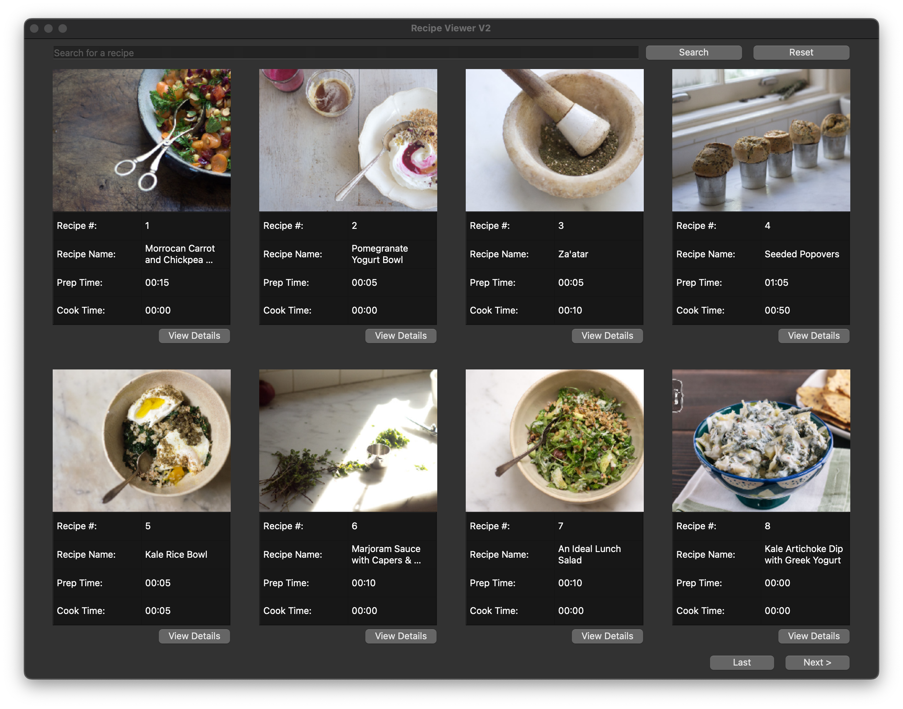

# Hey all,

This project was the second version of a 2-version simple recipe viewer application completed as an assignment for a Python programming course I took. 

It uses Python's PyQt6 module to create a interative GUI that displays a recipe's basic details like name, cook & prep times, and servings created and more if desired.

To keep the app simple, the recipe data was provided by the instructor (source: unknown) via a JSON file. The data was then converted and stored as objects inline with Python's object oriented principles.

Note: As a requirement of the assignment, the program will download and store images for all recipes with valid links (~800). It will create a subfolder called "images" in the current directory before doing so.

### Image Download & Progress Bar

### Graphical User Interface

\-Thanks,

Kay
